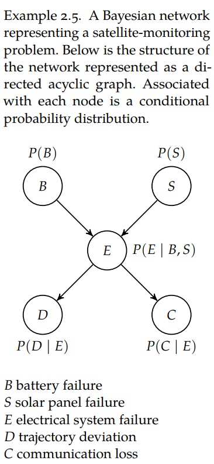

# bayesian-network

## Definition

- Not to be confused with [[bayesian-neural-networks]], this type of model is basically analogous to a [[decision-tree]], albeit as a directed acyclic [[graph]].
- Each node corresponds to a variable, with the directed edges their probabilities (transition probabilities like in [[markov-decision-process]]?)
- As an expression, with variable $X_i$, each edge corresponds to the [[conditional-distribution]] likelihood $P(X_i \vert Pa(X_i))$, where $Pa(X_i)$ are the parent nodes of $X_i$, i.e. every decision made prior to arriving at $X_i$.
  - $Pa(X_i)$ is actually computed with the chain rule; we have to evaluate the conditional likelihood of every event prior to $X_i$.
- From the [[decision-making-book]], we can describe how events that happen one after another as these Bayesian networks:

## Inference

- The utility of Bayesian networks is in Bayesian inference: inferring the likelihood of one event given some evidence. With the satellite example above, an example would be observing trajectory deviation, and asking what the likelihood of it being related to battery or solar failures.
- Bayesian networks undergo [[topological-sort]] algorithms before any inference is done with some sampling method.

#idea to parameterize Bayesian networks with graph neural networks; good application for #intel-research? This would relate to problems where the probabilities are not known, or for networks that are much larger than what could be done with sampling methods.

#idea to use Bayesian networks to infer molecule detections? Phrase detection problem as a Bayesian network, where the probability of detection for each molecule is a conditional probability.

[[bayesian-network-scoring]] is inferring the most likely network graph $G$, given a dataset.

[//begin]: # "Autogenerated link references for markdown compatibility"
[bayesian-neural-networks]: bayesian-neural-networks "bayesian-neural-networks"
[decision-tree]: decision-tree "decision-tree"
[conditional-distribution]: conditional-distribution "conditional-distribution"
[topological-sort]: topological-sort "topological-sort"
[//end]: # "Autogenerated link references"