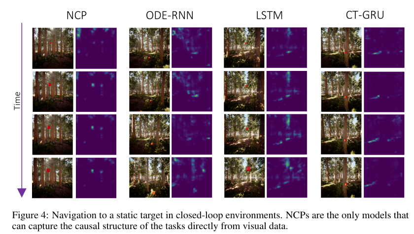

# Causal Navigation by Continuous time Neural Networks

## [arxiv](https://arxiv.org/abs/ARXIV)

*First written*: Mar/18/2022, 16:17:21

## Summary

- Causal modeling as a means to bridge the gap between direct, physical/mechanistic simulation and statistical learning
- Neural networks as an attractive means to parameterize causal models, with the idea of using continuous-time neural networks to capture causality
- This paper establishes certain types of continuous time neural networks represent *causal* models
- From a computing perspective, autonomous driving, scientific modeling, etc. all depend on predictable behavior from models; CT neural networks might be a critical part of AI workloads

## Introduction

- Physical, mechanistic models are descriptive and encompass an arbitrary amount of detail, and are inherently predictive but intractable for complex phenomena
- Continuous time neural networks as a special class of promising methodologies; the time forward-backward mapping makes them causal, and impose inductive bias.
- This paper proves that continuous time networks are able to capture causality, in contrast to regular neural networks, by testing on control/navigation tasks.
- The key partly lies with attention: how a neural network maps particular input pixels onto navigation decisions

### Problem

- Causal structures as directed acyclic graphs; see [[bayesian-network]]. The model implements a function $f_i$ for node/variable $X_i$, that maps parent nodes ($\mathrm{PA}_i$) of $X_i$ and stochastic variables $U_i$ into the state $X_i$. In other words, a function that takes into account past events to predict the current state: a [[markov-decision-process]].
  - Typical reinforcement learning (e.g Q-learning) the agent learns to make decisions based on a time-dependent reward expectation: this differs from a causal model, and the decision process can be "shortcut" unpredictably so.
- Differential equations model time-evolution of variables with unique mappings (i.e. [[lipschitz-condition]]), which is causal (future events can be predicted by using past information)
- Continuous time neural networks parameterize differential equations ($f_\theta$):

$$\frac{dx}{dt} = f_\theta(\mathrm{x}(t), t$$

- A specific class of continuous time networks, liquid time-constant networks, expand in complexity:

$$\frac{d\mathrm{x}(t)}{dt} = -[\frac{1}{\tau} + f_\theta(\mathrm{x}(t), t)] \odot \mathrm{x}(t) + f_\theta(\mathrm{x}(t), t) \odot A$$

where $\tau$ is thought of as a constant related to equilibrium, $A$ is an output control bias vector, and $\odot$ is the Hadamard product (elementwise operation). I don't have a great intuition for this expression, but to an extent it introduces "residual" elements that improve its expressitivity.

- Neural ODEs, by themselves, are not considered to be causal models, as they do not satisfy the causal mapping structure ($f_i(\mathrm{PA}_i, U_i)$) in the definition earlier. In other words, they do not account for perturbations even if they are Lipschitz continuous.
- A specific case, as in the liquid time-constant networks, resemble a type of causal model called [[dynamic causal model]] with a bilinear Taylor approximation; DCMs are designed specifically to capture both internal and external causes on a dynamical system, which fulfills our condition from earlier.
  - This paper provides three symbolic proofs: that LTC networks have unique solutions to initial value problems; as a neural network, can indeed be linked to the bilinear approximation to a DCM, which in turn allows parameters to be directly linked (causally) to predictions; forward- and backward-passes of the model give rise to causality.

### Methodology

- Simulated navigation environments using Microsoft AirSim and Unreal Engine; render photorealistic environments and three tasks with different memory horizons
- Agents were implemented with NCP, other neural ODEs, and RNNs in a closed- (i.e. position information feedback) and open-loop (no position feedback to the agent)
- Finding was that neural ODE architectures and RNNs perform poorling in open-loop scenarios, although all performed quite well within closed-loop. The authors ascribe this difference as causal reasoning by inspecting salicency maps (gradients of pixels w.r.t. control inputs): only NCP showed attention to the target in *why* it made a particular control decision.

  

- The result looks nice, but I can't help but wonder why they didn't use the same environment to show the saliency maps...
- The interesting thing to look at as well is how each model learns: for example, LSTM seems incredibly affected by lighting
- The last two experiments described, hiking and weather patterns, test memory and visual performance respectively. For the latter in particular, memory (or causality) is a crucial component because the agent cannot rely solely on visual perception: *what does this mean for object permanence?*

## Comments

- Would be interesting to see NCPs applied with inverse RL - can NCPs learn causality from expert trajectories?

## Further reading

- Lechner *et al*., Neural circuit policies enabling auditable autonomy. *Nature Machine Intelligence*
- Hasani *et al*., Liquid time-constant networks. *Proceedings of the AAAI Conference on Aritifcial Intelligence*
- Fristo *et al.*, Dynamic Causal Modelling. *Neuroimage*