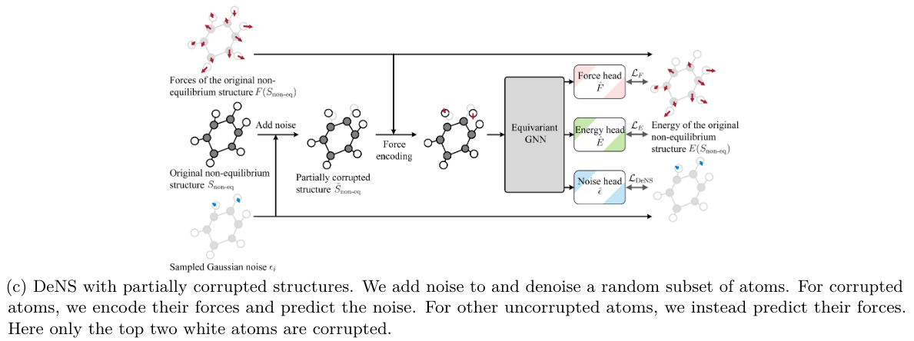

# Generalizing denoising to non-equilibrium structures improves equivariant force fields

## [arxiv](http://arxiv.org/abs/2403.09549)

_First written_: Aug/12/2024, 10:30:32

## Summary

- Building on top of [[noisy-nodes]] as a concept, this paper applies it specifically in the direction of force computation by devising a new training objective.
- The task is referred to as denoising non-equilibrium structures (DeNS), which as the name suggests, attempts to extend the noisy nodes framework to non-equilibrium structures, by selectively applying noise to some nodes based on their forces during training.

### Motivation

- Given that materials science datasets are nowhere near as large as those used for NLP/LLM, there is a natural emphasis on what we can do in terms of #pretraining and [[data-augmentation]] to try and make the most use out of the data we have.
  - Papers like DeNS look at developing principled ways for augmentation, i.e. what makes sense given atomic data has specific constraints compared to language.
- Previous papers have shown improvements in downstream modeling performance with denoising autoencoder pretraining on large equilibrium datasets like PCQM4Mv2.

### Methodology

- A structure is corrupted by adding noise to its 3D atomic coordinates, and the objective is to predict the noise (i.e. the vanilla denoising objective)
- Noise prediction is done by encoding the corrupted positions _and_ the forces of the uncorrupted structure
  - Caveat being that this is uniquely appropriate for equivariant models due to the nature of atomic forces, where we will need to maintain equivariance in the embedding process

The joint loss function is given by:

$$ \lambda_E \cdot \mathcal{L}_E + \lambda_F \cdot \mathcal{L}_F = \lambda_E \cdot \vert E'(S_\mathrm{non-eq}) - \hat{E}(S_\mathrm{non-eq})\vert + \lambda_F \cdot \frac{1}{\vert S_\mathrm{non-eq} \vert} \sum^{\vert S_\mathrm{non-eq} \vert}_{i=1} \vert \mathbf{f'}_iS_\mathrm{non-eq} - \hat{\mathbf{f}}_i (S_\mathrm{non-eq})\vert ^2$$

where $\lambda$ are weighting parameters, $S_\mathrm{non-eq}$ is a non-equilibrium structure, $\hat{E}$ and $\hat{f}$ are model predictions for the energy and force respectively. 

> [!IMPORTANT]
> Note that $E'$ is the normalized ground truth energy, given by $\frac{E(S_\mathrm{non-eq} - \mu E)}{\sigma E}$, and $f'$ is the normalized atom-wise force $\frac{f_i}{\sigma F}$.

The corrupted structure is generated by adding $\epsilon$ noise samples from $\mathcal{N}(0, \sigma I_3)$, i.e. $\~{S} = \{(z_i, \~{\mathrm{p}}_i)\}$, with $i$ running over the node indices, $z$ being the atomic number, and $\~{\mathrm{p}}_i = \mathrm{p}_i + \epsilon_i$. The task is then to predict the noise by minimizing the mean-squared error:

$$\frac{1}{\vert S \vert} \sum^{\vert S \vert}_{i = 1} \left \vert \frac{\epsilon_i}{\sigma} - \hat{\epsilon}(\~{S})_i \right\vert ^2 $$

> [!NOTE]
> The ground truth noise is rescaled by $\sigma$!

#### Force encoding

The innovation of this paper is to incorporate forces as an input; i.e. modify the expression above so that $\hat{\epsilon}\left (\~{S}_\mathrm{non-eq},F(S_\mathrm{non-eq}) \right)$. This generalizes it to the non-equilibrium case as in the equilibrium case, $F$ approaches zero.

The embedding of forces is the same as coordinates: given forces $\mathbf{f}_i$, we generate an encoding onto type-$L$ vectors with spherical harmonics using an $SO(3)$ linear layer:

$$x^{L}_\mathbf{f} = \mathrm{SO3\_ Linear}^L \left ( \vert \vert \mathbf{f} \vert \vert \cdot Y^L(\frac{\mathbf{f}}{\vert \vert \mathbf{f} \vert \vert}) \right)$$

> [!IMPORTANT]
> Since the force is normalized on the input side (i.e. scaled by $\sigma$), the spherical harmonic embedding is rescaled by the norm of the force to recover the force magnitude.

A diagram of the workflow from the paper is shown below:

  

The actual training regime, based on the figure above and as recommended by the authors, is to only _partially_ corrupt the structure, and isolate the denoising task to only the noisy nodes, and do force regression on only the uncorrupted nodes.

```julia
begin
  using Random, MaskedArrays, LinearAlgebra

  function make_noisy_nodes(p, dropout, rng)
    # assume shape [n, 3]
    num_nodes = size(p, 1)
    noise = randn(rng, Float32, (num_nodes, 3))
    noise = mask(noise, bitmask, :)
    # TODO this doesn't let you choose target percentage of masked nodes
    bitmask = bitrand(rng, num_nodes)
    # values that are masked out are zero
    noisy_p = p + noise
    return Dict("noise" => noise, "mask" => bitmask, "noisy_p" => noisy_p)
  end

  function embed_forces(model, forces, bitmask)
    force_norm = norm(forces, p=2)
    normalized_force = forces ./ force_norm
    # mask along node axis
    output = mask(model.(normalized_force), bitmask, :)
    return output
  end
end
```

## Comments

- Interestingly, the authors show that partially corrupted structures are better than completely corrupted ones for the task. My intuition for this is that it leads to a contrastative, self-supervised learning objective instead of an unsupervised one.
