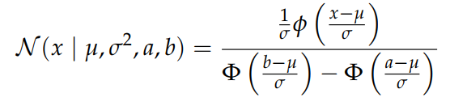
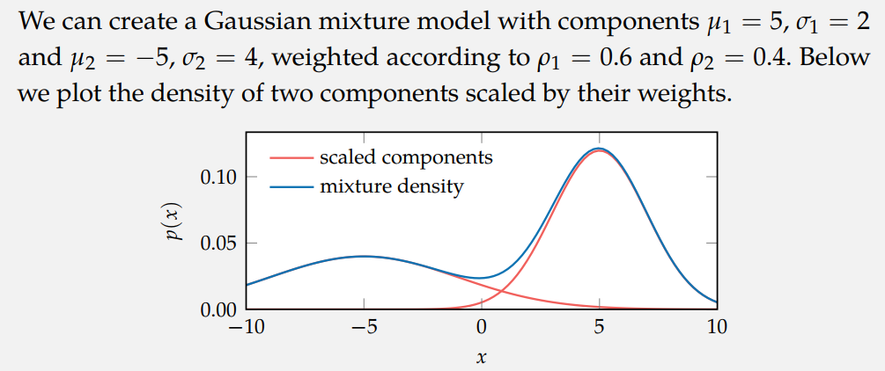

# distributions

## Truncated Gaussian

To #truncate a Gaussian:

## Mixture models

From [[decision-making-book]]:

> ...a mixture model, which is a mixture of multiple distributions. We mix together a collection of unimodal distributions to obtain a multimodal distribution. A Gaussian mixture model is a mixture model that is simply a weighted average of different Gaussian distributions.

The figure below just shows a Gaussian mixture as basically the sum of Gaussians.

