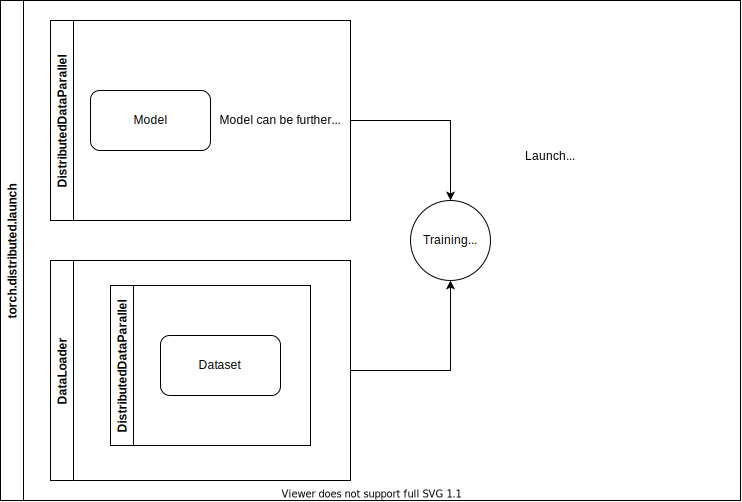

# dl-parallelism

- Parallelism in deep learning; check [[hpc]] for terminology
- Lots of stuff to unpack from [this link](https://yren.netlify.app/posts/pytorch_distributed_data_parallel_with_model_parallel_in_an_hpc_environment/)
  

## Data parallelism

- Preprocessing with distributed computing; form a pipeline for data transformation and loading
- PyTorch `DataParallel`, and in particular, `DistributedDataParallel` for multiple nodes

## Model parallelism

- When a model is too big to fit on one GPU, we would need to split components onto different GPUs
  - Basically, any `nn.Module` has `.to(device)` run, and each part of the `forward()` call would need to send its outputs to the next device as well.
  - PyTorch lightning should have good abstraction for this, so we don't have to explicitly pass data around

## Pipeline abstraction

In PyTorch, the abstraction using _just_ PyTorch looks like this:

#needs-expanding on how PyTorch lightning high level stuff is encorporated into this.

[//begin]: # "Autogenerated link references for markdown compatibility"
[hpc]: hpc "hpc"
[//end]: # "Autogenerated link references"