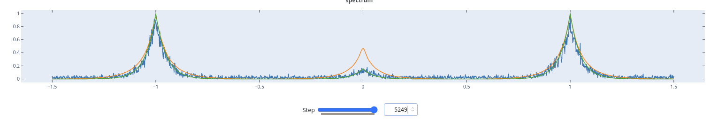
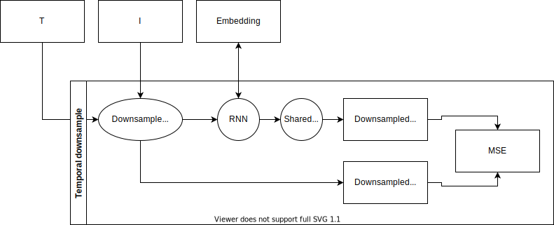

# g2-spectra

## Todo

- Change noise to be normalized to max of _true_, not of noise.
- Make Gaussian noise less likely

/date

## Forcing the latent variable on the decoder

By using a [[seq2seq]] model, the idea is that the decoder has no choice but to rely on the latent encoding to reconstruct the spectrum, given a timestep. This contrasts with the prior approach of using an autoregressive model, whereby the decoder sees the timesteps _and_ noisy photon counts, with the latent variables constituting the initial hidden state. The thing found here was that with the `CLVAE` model, the only probabilistic parts was the initial few steps, and quickly became more or less deterministic for the rest of the architecture.

- #needs-testing actually should try making the latent variable the _cell state_ not the hidden state. The cell state is unique to LSTMs, and stores the long term memory that might be what's needed to make the _whole_ spectrum probabilistic.

## Learning at different temporal resolutions

- For very long [[sequential-data]], [[recurrent-models]] lose sight very quickly because they have to backprop all the way through time: this is very apparent when trying to do a `seq2seq` type model for the $g_2$ spectra, which end up simply predicting the mean of the data regardless of the inputs (taken from `sleek-monkey-36`):

- For this project, I developed a model that learns the same sequential data at different resolutions, hoping that this will solve this problem
- The figure below shows the [[architecture]] plan: basically for every "Temporal downsample" layer, we downsample the timesteps and photon counts, with the former being inputs to an RNN model. The RNN predicts the photon counts at each timestep, and is compared with the corresponding downsampled ground truth spectrum.

- For the training loop, a shared `output` RNN is used to convert the RNN spectrum to the corresponding downsampled prediction: for inference, this is not needed as we probably just want the final output.
- The important thing with this architecture, is that hopefully the low-resolution (and therefore correspondingly short sequences) are easier to learn from, and carry information over to progressively higher resolutions.
- #needs-research because I don't know if someone else has done this before.

[//begin]: # "Autogenerated link references for markdown compatibility"
[recurrent-models]: recurrent-models "recurrent-models"
[//end]: # "Autogenerated link references"