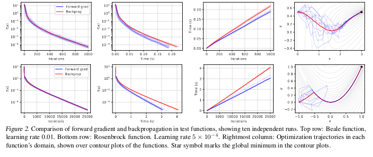
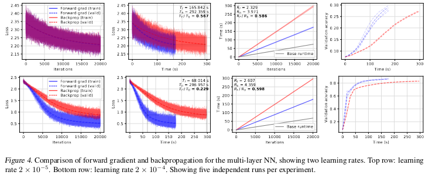
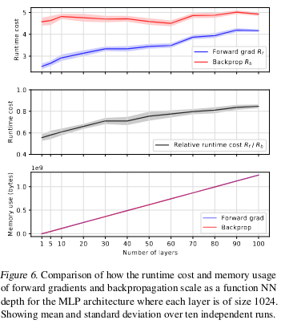

# Gradients without Backpropagation

## [arxiv](https://arxiv.org/abs/2202.08587v1)

*First written*: Mar/27/2022, 08:38:20

## Summary

This paper derives a methodology for computing gradients during the forward pass of a neural network, as opposed to "backpropagation", which conventionally requires a second, reverse pass of the network to compute gradients for optimization.

## Introduction

- Differentiability is one of the main reasons for success in modern machine learning; frameworks support model optimization with efficient automatic differentiation (AD).
- Neural networks typically present a special two-phase algorithm for differentiation, whereby scalar valued objectives are differentiated against many parameters in an efficient manner with "reverse mode" AD.
- The umbrella of AD algorithms include both reverse (the conventional type) and forward modes, with the latter requiring only a single evaluation of a function; the caveat is that the two modes evaluate different quantities: for a function that maps $n$ dimensions to $m$, $f: \mathbb{R}^n \rightarrow \mathbb{R}^m$

The forward mode evaluates a Jacobi-vector product:

$$J_f v; J_f \in \mathbb{R}^{m\times n}, v \in \mathbb{R}^n$$

The reverse evaluates a vector-Jacobi product:

$$v^T J_f; v \in \mathbb{R}^m$$

In the specific case of scalar valued objective functions, where $f: \mathbb{R}^n \rightarrow \mathbb{R}$, forward mode gives the vector directional derivative $\nabla f \cdot v \in \mathbb{R}$ whereas the reverse mode gives what we actually want, which is the full gradient $\nabla f \in \mathbb{R}^n$.

### Reverse-mode AD

Given a neural network function $f$ parameterized by $\theta$ that maps $n$ dimensions to $m$, the typical reverse mode AD evaluates the vector-Jacobi product $v^T J_f(\theta)$, where $J_f (\theta) \in \mathbb{R}^{m \times n}$ is the full Jacobian of all partial derivatives of $f$ evaluated at $\theta$.

For the case where $f: \mathbb{R}^n \rightarrow \mathbb{R}$, reverse mode AD yields the partial derivatives of $f(\theta)$ for $n$ inputs, such that $\nabla f (\theta) = [\frac{\partial f}{\partial \theta_1}, \ldots, \frac{\partial f}{\partial \theta_n}]$, i.e. a vector of gradients with respect to parameters $\theta$.

### Forward-mode AD

Given a neural network function $f$ parameterized by $\theta$ that maps $n$ dimensions to $m$, the forward mode AD evaluates the Jacobi-vector product $J_f(\theta) v$, where $J_f (\theta)$ is a matrix comprising all partial derivatives of $f$ evaluated at $\theta$, with $v$ a vector of perturbations/tangents.

For the case where $f: \mathbb{R}^n \rightarrow \mathbb{R}$, i.e. maps $n$ dimensions into a scalar, we evaluate $\nabla f(\theta) \cdot v$, which is the projection of gradients along the perturbations $v$. Because we're evaluating projections of the gradient, to evaluate the full Jacobian matrix as needed for optimization, we could use forward mode $n$ times in a column vector basis, which would yield columns of $J$.

The challenge therefore is to find a method that evaluates forward-mode AD for parameter gradients _without_ needing to it $n$ times.

### Performance

According to [^1], both modes of AD involves a constant multiple of the time required to evaluate $f$.

The typical reverse mode needs to perform a backward pass, and needs to use some memory mechanism to track all forward operations, which are used in the backward mode evaluation. The forward mode naturally does not require this.

Factorizing the cost of AD as primitive operations, everything boils down to memory access, additions, multiplications, and nonlinearities. Because AD takes a constant multiple of $f$ runtime, the authors conveniently express forward- and reverse-mode AD time as $R_f$ and $R_b$, with $R_f$ on the order of 1&ndash;3, and $R_b$ on the order of 5&ndash;10 with the caveat that this depends heavily on the nature of the program/application.[^2]

## Methodology

To make forward-mode AD viable, we need a trick to expose $\nabla f$ from $\nabla f \cdot v$; i.e. project the directional vector $v$ out. In order to do so, the steps taken by the authors are:

1. Sample random perturbation vector $v \sim p(v)$,
2. With forward-mode AD, obtain $f(\theta)$ and $\nabla f(\theta) \cdot v$
3. Multiply $\nabla f(\theta) \cdot$ with vector $v$ to obtain gradient $g(\theta)$

The chief proofs of this paper is to show that the forward gradient $g(\theta)$ is an unbiased estimator of the true partial derivative $\nabla f(\theta)$ by the expectation value:

$$\mathbb{E}[g_i(\theta)] = \mathbb{E}[\frac{\partial f}{\partial \theta_i}v^2_i + \sum_{j\neq i} \frac{\partial f}{\partial \theta_j} v_i v_j]$$

and for the case when $\mathbb{E}[v^2]$ is expressed in terms of $\mu = 0, \sigma = 1$, i.e. $v \in N(0, 1)$, we reduce the equation above to $\mathbb{E}[g(\theta)] = \nabla f(\theta)$.

Concretely, they present a "forward-mode" gradient descent algorithm for iterations $t$:

1. Sample perturbations from a multivariate Gaussian with diagonal covariance; $v_t \sim N(0, I)$
2. Compute the Jacobi-vector product ($d_t$) and function ($f_t$)
3. Compute gradients as vector-scalar product $g_t \leftarrow v_t d_t$
4. Perform parameter updates as per usual ($\theta_{t+1} \leftarrow \theta_t - \eta g_t$)

## Results

On toy model functions (e.g. Beale and Rosenbrock), the results suggest that forward grad is marginally faster than backprop, albeit with some interesting optimization trajectories. Both end up in the global minima, although forward grad shows some pretty crazy ways to get there (blue traces, rightmost panel for each row)

  

Stepping up in function complexity, the authors look at MNIST classification with MLPs. The key results here are that empirical mean runtimes for both forward- and reverse-mode AD are $R_f = 2.46 and $R_b = 4.17$ respectively, showing a non-trivial speedup for the former. The other potential benefit owing to the stochastic optimization trajectories is you basically have an annealing effect, whereby the model implicitly explores more regions the loss surface and reaches convergence quicker.

  

That said, the last figure seems to dimminish the allures of forward-mode AD: at the limit of a large number of layers/parameters, the runtime improvement of forward-mode AD diminishes. Another aspect I don't understand is why the memory usage is also effectively the same for both forward- and reverse-mode.

  

## Further reading

[^1]: Griewank, A. and Walther, A. Evaluating Derivatives: _Principles and Techniques of Algorithmic Differentiation._ SIAM, 2008.
[^2]: Hasco ̈ et, L. _Adjoints by automatic differentiation._ Advanced Data Assimilation for Geosciences: Lecture Notes of the Les Houches School of Physics: Special Issue, June 2012, (2012):349, 2014.