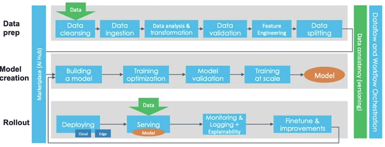

# ml-pipelines

Summed up quite  nicely by this image taken from the CD foundation, used in the Coursera [[ml-ops]] course:

Some examples of ML pipeline frameworks are like [Tensorflow Extended](https://www.tensorflow.org/tfx/) or #tfx uses the Tensorflow ecosystem for end-to-end applications, e.g. Keras for models, Tensorflow Transform for feature engineering, and Tensorflow Serving for model serving.

