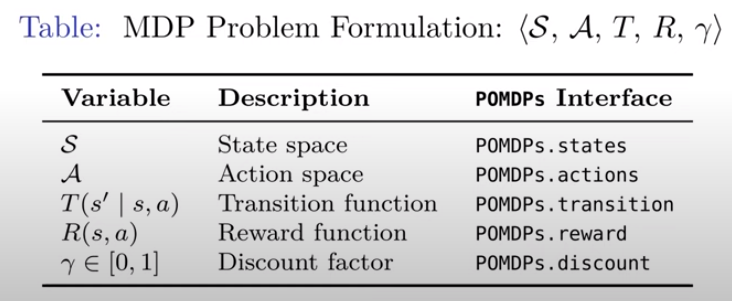

# pomdp

Partially observable Markov Decision Processes

> A problem formulation that enable optimal sequential decisions to be made in uncertain environments (Intro to POMDPs.jl course)

Abstractions are general to [[decision-theory]]: agent makes decisions based on current state $s$, choosing action $a$ that is motivated to maximize the expected reward $r$ according to a policy $\pi$

## Types of MDP solvers

- Discrete value iteration
- Local approximation value iteration
- Global approximation value iteration
- Monte Carlo tree search

## Notes on the Julia implementation, POMDP.jl

[//begin]: # "Autogenerated link references for markdown compatibility"
[decision-theory]: decision-theory "decision-theory"
[//end]: # "Autogenerated link references"