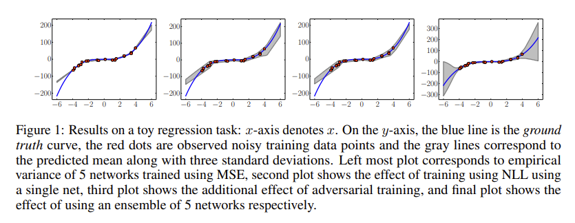
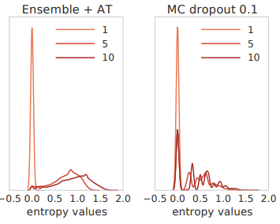
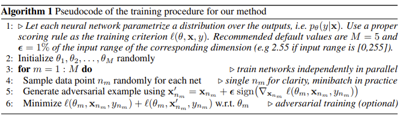

# scalable-uncertainties-from-deep-ensembles

## [arxiv](https://arxiv.org/abs/1612.01474v3)

*First written*: Aug/20/2021, 09:32:40

## Summary

- While [[neural networks]] are good at a wide range of tasks, they aren't good at knowing *when* and *what* they don't know.
- Part of the problem with this is that there is no ground truth for uncertainty; not something that can be easily testable. **Same problem associated with quantifying #generalization since the data we need is by definition not available to us.**
- This paper looks at using two ways to measure uncertainty from neural networks: [[calibration]] and [[domain shift]] or "out-of-distribution examples".
- Interpretation of [[dropout]] uncertainties by Gal and Ghahramani as both [[MCMC]] sampling, as well as "creation" of [[ensembles]] of neural networks.
- Fundamentally, the question is whether or not ensembles of neural networks are any good at providing good uncertainty estimates.
  - > [[bayesian model averaging]] assumes that the true model lies within the hypothesis class of the prior, and performs *soft model selection* to find the single best model within the hypothesis class.
  - > ...ensembles can be expected to be better when the true model does not lie within the hypothesis class.
- A deep ensemble is supposed to be easier to implement and train than [[bayesian-neural-networks]], either variational or MCMC.

### Calibration

- This figure shows the performance of the approach w.r.t. a simple 1D regression task, where $y = x^3 + \varepsilon$ 
  - First panel is empirical variance. **Probably not much because each NN converges to the same weights?**
  - Second panel is training NLL using a single NN, third smooths the process with adversarial training.
  - Final panel combines NLL + AT with five NNs.
- Other comparison made is on a few tabular datasets; deep ensembles typically have larger RMSE but better NLL.

### Domain shift

- Test predictions on data from _unseen_ classes: uncertainties should be proportional to distance from training data.
- Model is trained on a standard [[MNIST]] train/test split, however an additional testing class of [[NotMNIST]].
- >  We do not have access to the true conditional probabilities, but we expect the predictions to be closer to uniform on unseen classes compared to the known classes where the predictive probabilities should concentrate on the true targets
- The left panel shows how the distribution in [[entropy]] is much broader/uniform for the ensemble + AT case, compared to the dropout uncertainties which are also much more discrete. 
- Define a "confidence" value $0 \leq \tau \leq 1$ defined as the highest probability of a class. **It shouldn't always be one for unseen examples.** 

## Strategy

- > Given the input features $x$, we use a neural network to model the probabilistic predictive distribution $p_\theta(y \vert x)$ over the labels, where $\theta$ are the parameters of the NN.
- Three steps:
  1. Use a proper [[scoring rule]]; $-S(p_\theta, y \vert x) \in \mathcal{L}$ where $S$ can be [[maximum likelihood]]/[[mean squared error]]/[[softmax]]. MSE is also known as the [[Brier score]].
  2. [[Adversarial training]] to smooth the predictive distribution
  3. Train an ensemble **lol**



### Regression

- Typical regression NN will minimize MSE, i.e. the output corresponds to the regression mean. Here, the authors suggest to output *two values*: the predicted mean and variance. The variance is done via $\sigma = (1 + \exp(x)) + \varepsilon$ where $\varepsilon$ is a small positive number of numerical stability.
- The [[negative log-likelihood]] criterion used:
$$-\log p_\theta(y_n \vert x_n) = \frac{\log \sigma^2_\theta(x)}{2} + \frac{(y - \mu_\theta(x))^2}{2\sigma^2_\theta(x)} + C$$

Julia implementation:

```julia
begin
  function nll(mu, var, y)
    return log(var^2) / 2 + (y - mu)^2 / (2 * var^2) + eps(Float32)
  end
end
```

### Adversarial training

Basically use conventional [[fast gradient sign method]], or [[virtual adversarial training]].

### Ensemble training

- Choice between [[decision trees]] or [[boosting]]; the authors chose the former because they are much better for distributed training.
- There is an extensive discussion into decorrelation of trees with [[bootstrapping]]; the authors instead just use random initialization of the parameters, and shuffle the training data points for each "tree" in practice.
- Apparently [[stochastic-multiple-choice-learning]] helps with de-correlating the NN "trees".
- Ensemble as a uniformly-weighted [[mixture model]]
  - For classification, averaging the predicted probabilities
  - For regression, Gaussian mixture, with a mixture mean $\mu_*(x)$ and variance $\sigma_*(x)$

$$\mu_*(x) = \frac{1}{M}\sum_m \mu_{\theta_m}(x)$$

$$\sigma_*^2(x) = \frac{1}{M}\sum_m(\sigma^2_{\theta_m}(x) + \mu^2_{\theta_m}(x)) - \mu_*^2(x)$$

A naive Julia implementation:

```julia
begin
  """Reduce the predictions from each tree into an ensemble
  mean and variance. Assumes `means` and `vars` are a list
  of vectors.
  """
  function reduce_ensemble(means, vars)
    means = reduce(hcat, means)
    ensemble_mean = mean(means, dims=2)
    vars = reduce(hcat, vars)
    ensemble_var = mean(means.^2 .+ vars.^2, dims=2) .- ensemble_mean.^2
    return ensemble_mean, ensemble_var
  end

  """Given a struct `ensemble`, and inputs `x`, we loop over
  each tree in the ensemble/forest (also assuming tree is a functor)
  and collect up all of the means/variances predicted by each tree.
  We then bag the results.
  """
  function predict(x, ensemble)
    means, vars = [], []
    for tree in ensemble.forest
      mean, var = tree(x)
      push!(means, mean)
      push!(vars, var)
    end
    ensemble_mean, ensemble_var = reduce_ensemble(means, vars)
  end
end
```

## Comments

- Good for #distributed training; maybe a good use case for #intel-research.
- 5 NN's seem good enough for uncertainty estimation, but not sure how this really actually scales for real tasks.
- How does it really fit into a hypothesis testing context?

[//begin]: # "Autogenerated link references for markdown compatibility"
[ensembles]: ensembles "ensembles"
[bayesian-neural-networks]: bayesian-neural-networks "bayesian-neural-networks"
[scoring rule]: scoring rule "scoring rule"
[Adversarial training]: Adversarial training "Adversarial training"
[negative log-likelihood]: negative log-likelihood "negative log-likelihood"
[fast gradient sign method]: fast gradient sign method "fast gradient sign method"
[virtual adversarial training]: virtual adversarial training "virtual adversarial training"
[boosting]: boosting "boosting"
[stochastic-multiple-choice-learning]: stochastic-multiple-choice-learning "stochastic-multiple-choice-learning"
[//end]: # "Autogenerated link references"