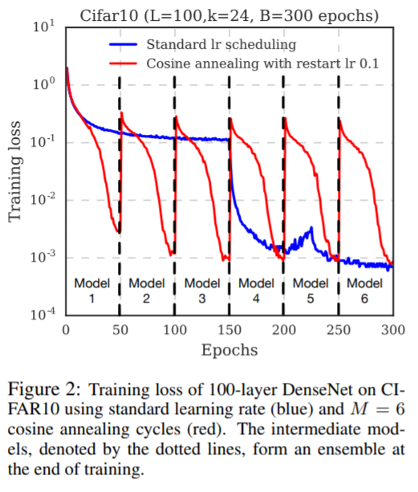
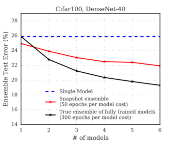
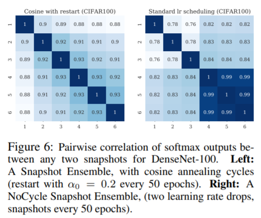

# snapshot-ensembles

## [arxiv](https://arxiv.org/abs/1704.00109)

*First written*: Nov/05/2021, 08:54:10

## Summary

Ensembling neural networks is a nominally expensive process, as training one is computationally intensive enough as it is. In this paper, the authors propose getting free #ensemble submodels by taking snapshots of a training trajectory: combined with #cyclic-annealing, you nominally get sufficient model diversity to make up a good ensemble.

## Introduction

- Exploiting local minima as useful, information-containing solutions to neural network optimization
- Apparently according to Keskar[^1], shallow local minima are better at generalization than deep ones. Intuitively, this makes sense because the difference in performance is smaller for shallow minima.
- Number of local minima grows exponentially with the number of parameters, according to Kawaguchi[^2]; this observation provides the foundation for snapshot ensembles, as no two local minima should closely resemble one another.
  - This extends to random initialization and minibatching too.
  - > Although different local minima often have very similar error rates, the corresponding neural networks tend to make different mistakes
- Cosine annealing abruptly raises and lowers the learning rate, and forces the trajectory to visit new local minima.
- With this, you can get $M$ snapshots out of $K$ trajectories, i.e. getting $MK$ models for the training cost of $K$.

### Related work

- Swann & Allinson, Xie have proposed ensembles from slices of the learning trajectory
- Xie proposed horizontal and vertical ensembling, combining the output of networks through a range of training epochs
- Jean _et al._ and Senrich show intermediate training stages yield better results for ensembling
- Laine & Aila propose temporal ensembling, averaging models with different regularization and augmentation to optimize generalization. _Basically like #model-selection_.

## Methodology

- > Ensembles work best if the individual models (1) have low test error and (2) do not overlap in the set of examples they misclassify
  - _Not sure how we can encourage the latter without modifying the training splits_
- _This is somewhat of an early stopping problem; more epochs typically mean overfitting_. The authors recommend fewer epochs, and faster cycling.
  - > We lower the learning rate at a very fast pace, encouraging the model to converge towards its first local minimum after as few as 50 epochs.
  - _I guess the idea here is to find as many local minima as quickly as possible_

Learning rate cycling form:

$$\alpha(t) = f(\text{mod}(t - 1, [T/M]))$$

with $t$ as the current training iteration, $T$ as the total number of training steps, and $f$ is a monotonically increasing function for $M$ cycles. Intuitively, start with large learning rate and annealed to a smaller one.

The specific form used in this work is a cosine:

$$\alpha(t) = \frac{a_0}{2}\left(\cos\left(\frac{\pi \text{mod} (t - 1, [T/M]) }{[T / M]} + 1 \right)\right)$$

- Snapshots are taken just before the learning rate is cycled back to large values-approximately 50 epochs per snapshot to give 6 snapshots. The training dynamics look like this:

## Results

- Typically better errors on tasks, although only marginally so compared to single models.
  - _I guess that's fine since we're getting this for free, although better error is probably not my main reason for ensembling_
- The **SingleCycle Ensemble** comparison is an interesting one: this is a model that is re-initialized at the beginning of every cycle, as opposed to carrying over optimization from the previous runs.
  - Authors used this to highlight model diversity versus optimization; in theory more diverse, but less optimized.
  - **SingleCycle Ensemble** performs worse than the single model for all tests.
- > The NoCycle Snapshot Ensemble generally has little effect on performance, and in some instances even increases the test error. This highlights the need for a cyclic learning rate for useful ensembling
- > At the extremes, M = 2 and M = 10, we find a slight degradation in performance, as the cycles are either too few or too short. In practice, we find that setting M to be 4 ∼ 8 works reasonably well.

This figure is quite interesting, because it actually compares the performance of the snapshot ensembles with conventional ensembles, i.e. $M$ training regimes for $M$ different models:

True ensemble performs better, by a fair bit.

> Firstly, all of the cyclic snapshots achieve roughly the same error as the final cyclical model, as the error is similar for λ = 0 and λ = 1. Additionally, it appears that most snapshots do not lie in the same minimum as the final model.
> Thus the snapshots are likely to misclassify different samples. Conversely, the first three snapshots achieve much higher error than the final model.

The final bits of the paper assess diversity in the ensemble: a numerical test where they tune the importance of two submodels w.r.t. each other against the test error, and a softmax correlation comparison (shown below).

A look at this kinda shows that the models are still pretty correlated. _Wonder if this is simply a fact of not being Markovian enough?_

## Comments

- Overall this seems like a good deal for getting submodels for an ensemble, and it'll be interesting to see how this could fit in with [[scalable-uncertainties-from-deep-ensembles]]
- Still an open question however, on how to improve diversity in the models. IMO neural networks don't really have a bias problem, but really a variance one for ensembling.
- The takeaways include the necessity for annealing, and some ideas that might be interesting to explore for #intel-research
  - Dynamic spawning of submodels, like in _ab initio_ dynamics
  - How to minimize correlation between ensemble submodels
  - How scalable $MK$ models are for parallel $K$ training - can we dial it up and that simply solves our diversity problem?

[^1]: Nitish Shirish Keskar, Dheevatsa Mudigere, Jorge Nocedal, Mikhail Smelyanskiy, and Ping Tak Peter Tang. On large-batch training for deep learning: Generalization gap and sharp minima. arXiv preprint arXiv:1609.04836, 2016.
[^2]: Kenji Kawaguchi. Deep learning without poor local minima. arXiv preprint arXiv:1605.07110, 2016

[//begin]: # "Autogenerated link references for markdown compatibility"
[scalable-uncertainties-from-deep-ensembles]: scalable-uncertainties-from-deep-ensembles "scalable-uncertainties-from-deep-ensembles"
[//end]: # "Autogenerated link references"