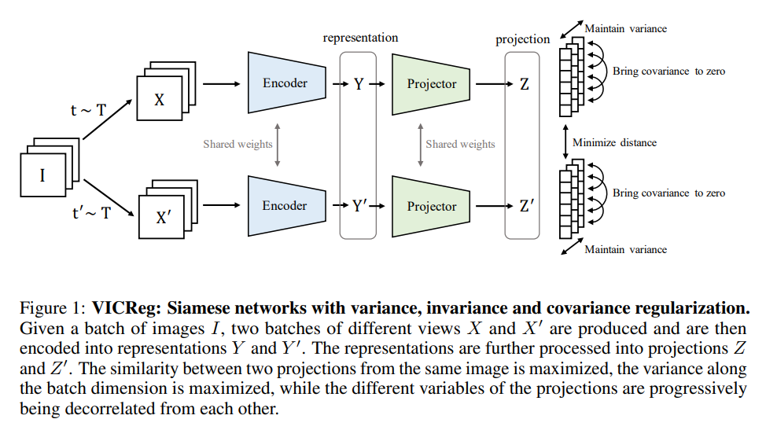

# vicreg: Variance-invariance-covariance regularization for self-supervised learning

## [arxiv](https://arxiv.org/abs/2105.04906)

*First written*: Sep/03/2021, 09:20:52

## Summary

- Un/self-supervised learning of representations is difficult: embeddings can likely end up with highly correlated features[^1]
  - We also want to preserve the idea that similar inputs should result in similar encodings, with the most straightforward result being the same embedding regardless of inputs (i.e. a *collapse*). This also involves some clustering heuristic that might not be simple.
- Conventionally, good embeddings can be obtained through [[contrastive-learning]], forcing dissimilar inputs to have different embeddings, and vice versa
  - Contrastive learning is expensive, however, because to do it well you have to find examples and counterexamples during training; e.g. [[triplet-loss]] variants.
- VICReg encodes three heuristics as a form of regularization: variance, invariance, and covariance

[^1]: If they're correlated, you are not using each dimension as effectively as you *could*.

## Useful embeddings

- The requirements typically are:
  - Similar inputs -> similar embeddings (i.e. clustering)
  - Dissimilar inputs -> dissimilar embeddings (i.e. contrast)

## VIC regularization

> ...the architecture is completely symmetric and consists of an encoder $f_\theta$ that outputs the final representations, followed by a project $h_\phi$ that maps the representations into projections in a embedding space where the loss function will be computed.

- Projector gets rid of low-level information in the representations, and is only used for computing the loss (i.e. not used for actual tasks)

### Notation

| Symbol | Meaning |
|--------|---------|
| $Z$, $Z'$    | Batch of embeddings, for either network |
| $Y$ | The representation used for tasks |
| $n$    | Batch size |
| $d$    | Embedding dimensionality |
| $v$    | Variance (regularization) |
| $\epsilon$ | Small scalar for stability |

### Architecture

### Variance

The variance regularization term is given by a [[hinge-loss]]:

$$ v(Z) = \frac{1}{d}\sum_{j=1}^{d}\max(0, \gamma - \sqrt{\mathrm{Var}(Z_{:,j}) + \epsilon}) $$

where $\gamma$ is a target value for the standard deviation (fixed to one for this paper)[^2], and $\mathrm{Var}(x)$ is the variance estimator:

$$\mathrm{Var}(x) = \frac{1}{n - 1}\sum_{i=1}^n(x_i - \bar{x})^2$$

This forces the variance in a batch of embeddings to be $\gamma$ along each dimension.

### Covariance

The covariance of matrix $Z$ is given as:

$$C(Z) = \frac{1}{n - 1}\sum_{i=1}^n(Z_i - \bar{Z})(Z_i - \bar{Z})^T$$

with $\bar{Z}$ being the mean embedding across a batch. The actual covariance loss term is taken as the squared off-diagonal coefficients of $C$ that scales with dimensionality $1/d$:

$$c(Z) = \frac{1}{d}\sum_{i\neq j}C(Z)^2_{i,j}$$

So that we force the embeddings to learn unit Gaussians similar to the $\beta$-regularization in [[variational autoencoder]].

### Invariance

The invariance loss is given by:

$$s(Z,Z') = \frac{1}{n}\sum_i \vert\vert Z_i - Z'_i \vert\vert ^2_2$$

i.e. the mean squared Euclidean distance between each network embedding pair.

- This encourages the model to learn the same upstream representation for nominally the same input.

### The full loss

$$l(Z,Z') = \lambda s(Z,Z') + \mu\{v(Z) + v(Z')\} + v\{c(Z) + c(Z')\} $$

with hyperparameters $\lambda$, $\mu$, and $\nu$.

## Comments

[^2]: Might be worth seeing how this changes stuff

[//begin]: # "Autogenerated link references for markdown compatibility"
[variational autoencoder]: variational autoencoder "variational autoencoder"
[//end]: # "Autogenerated link references"